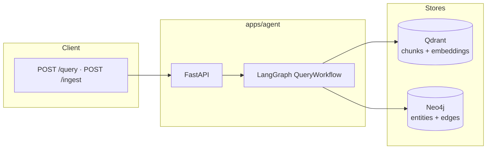
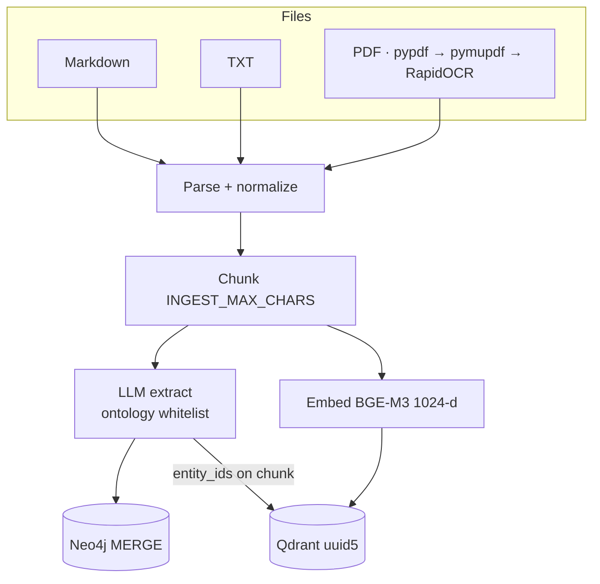
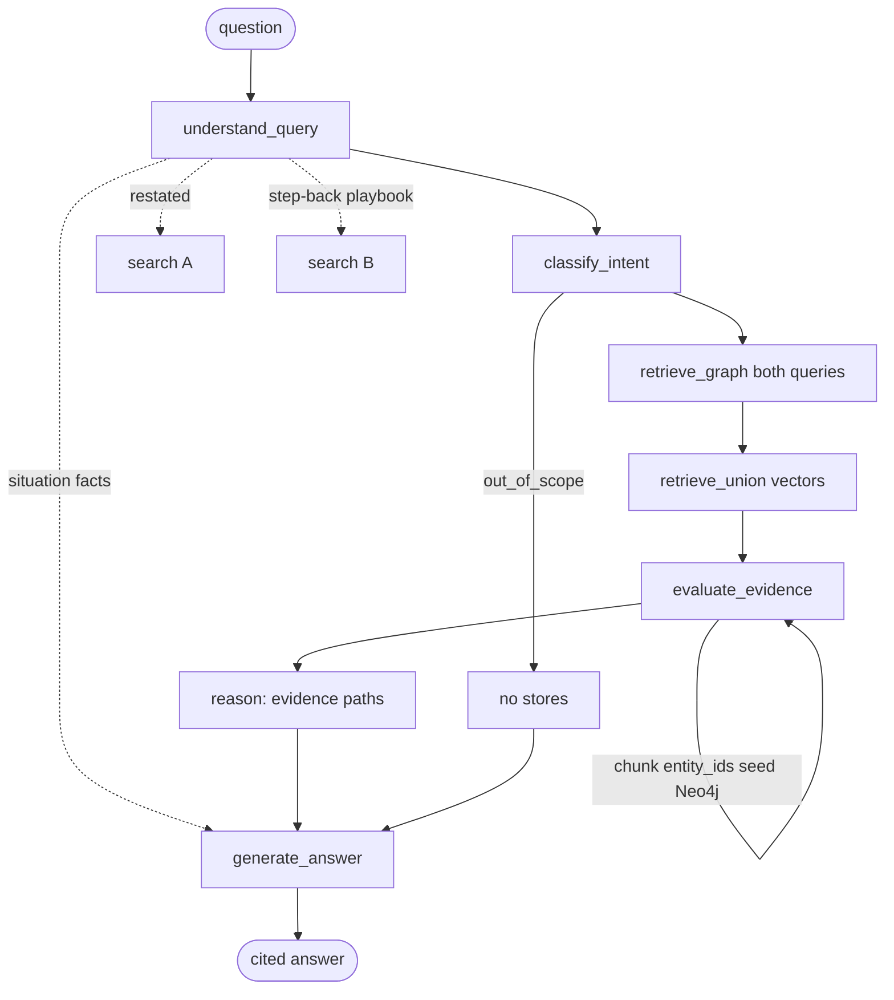
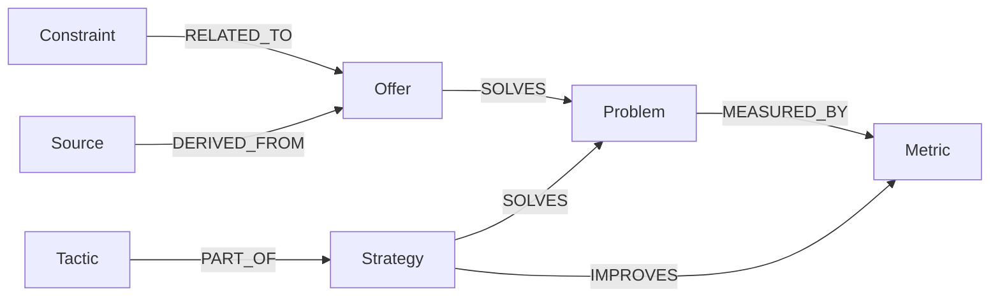

<div align="center">

# Agentic GraphRAG

**Typed knowledge graph + dense retrieval + a LangGraph that never confuses a playbook with a case.**

Python 3.12 · FastAPI · LangGraph · Qdrant · Neo4j · local BGE-M3 · MIT

[](https://github.com/Lucimad007/graphrag-hormozi-business/actions/workflows/ci.yml)
[](https://www.python.org/)
[](LICENSE)
[](https://docs.astral.sh/uv/)
[](https://docs.astral.sh/ruff/)
[](apps/agent/tests)
[](https://qdrant.tech/)
[](https://neo4j.com/)
[](https://langchain-ai.github.io/langgraph/)
[](https://fastapi.tiangolo.com/)

*Not affiliated with Alex Hormozi or Acquisition.com. Copyrighted books are not in this repository.*

</div>

---

A strategy question is a **path**, not a similar paragraph.

> Gym. Instagram leads are high. Close rate fell from **40% → 20%** on a **$3k** offer. What is going on?

Nearest-neighbor RAG matches “Instagram” and “gym.” This system stores `LeadSource → Problem → Metric → Offer`, retrieves **playbook passages and graph edges**, then answers **that gym** — numbers kept, sources cited.

| Layer | Job |
|--------|-----|
| **Ontology** | Illegal entity/edge types never enter Neo4j |
| **Qdrant** | Chunks with source, section, `entity_ids`, score |
| **Neo4j** | `SOLVES`, `MEASURED_BY`, `IMPROVES`, … parameterized Cypher |
| **LangGraph** | Search with a step-back query; generate with the original situation |

Monorepo: [`apps/agent`](apps/agent) · [`packages/ontology`](packages/ontology) · synthetic notes in [`knowledge/samples`](knowledge/samples) · [architecture](docs/architecture.md) · [local setup](docs/local-setup.md)

## Architecture

### System



### Ingest

Parse → normalize → chunk (characters, not tiktoken) → ontology extract → embed → idempotent upsert.



Failed JSON on a chunk is **skipped**, not a full abort. Truncated LLM JSON is salvaged when possible. Image-only PDFs go through OCR.

### Query — search broad, answer specific

Step-back is **retrieval only**. Generation always receives `original_query` + `situation` (channel, offer, percents).



```
START → understand_query → classify_intent
      → retrieve_graph → retrieve_vector → evaluate_evidence
      → reason → generate_answer → END
```

### Ontology (excerpt)

Extraction **rejects** unknown types and disallowed triples. Registry `1.0.0` — extend without rewriting stores.



**Entities:** Business, Customer, Offer, Problem, Metric, Strategy, Tactic, Concept, Constraint, Prerequisite, Outcome, LeadSource, BusinessStage, Evidence, Source.

**Relations:** `SOLVES` `IMPROVES` `REQUIRES` `TARGETS` `CAUSES` `RELATED_TO` `CONFLICTS_WITH` `DERIVED_FROM` `APPLIES_TO` `MEASURED_BY` `PART_OF`

## Why this over “chat the PDF”

| Naive RAG | This repo |
|-----------|-----------|
| One embedding of the user sentence | Union of **restated** + **step-back** queries |
| LLM free-associates | Answer must apply retrieved playbooks to **stated numbers** |
| Graph optional garnish | Chunks carry `entity_ids`; hits **expand** the subgraph |
| Hidden chain-of-thought | API returns intent, restated, step-back, situation, evidence paths |
| Re-ingest duplicates | Qdrant **uuid5**, Neo4j **MERGE** |
| OpenAI tokenizer on a DeepSeek model | **Character** windows |

## Tech stack

| Concern | Choice | Notes |
|---------|--------|--------|
| Runtime | Python 3.12, [uv](https://docs.astral.sh/uv/) workspace | `apps/agent` + `packages/ontology` |
| HTTP | FastAPI + Pydantic v2 | `/health` `/ingest` `/query` |
| Workflow | LangGraph `StateGraph` | Typed `QueryState`, intent routing |
| Vectors | Qdrant | Payload: source, document, section, entity ids |
| Graph | Neo4j 5 | Parameterized Cypher; rel types ontology-whitelisted |
| Embeddings | FlagEmbedding **BGE-M3** (default) | 1024-d, local. Voyage / OpenAI-compatible optional |
| LLM | OpenAI-compatible | Default example: OpenCode Go / DeepSeek Flash |
| Ingest | pypdf, pymupdf, RapidOCR, docx | Parallel extract, skip-bad-chunk |
| Config | pydantic-settings | Secrets never committed (`.env` gitignored) |
| Local infra | Docker Compose | Qdrant + Neo4j + optional agent image |
| Quality | pytest (mocked stores/LLM), Ruff, lexical eval set | CI on `main` |

No TypeScript. Contracts are Pydantic. No PostgreSQL: provenance is Neo4j `Source` nodes + Qdrant payloads.

## Questions and answers

Examples below are the **shape** of a grounded reply over the **synthetic** notes in `knowledge/samples` (and, if you ingest your own lawful corpus, the same contract). The model is not treated as if it memorized a commercial book.

### Diagnosis

**Q.** What is probably causing a business with lots of leads but a low close rate?

**A.** Lead volume is the wrong metric. Close rate is what is failing: qualified conversations are not becoming customers. Inspect **offer clarity** and **sales follow-up** before buying more traffic. High inbound with a weak close is an offer/process problem, not a media problem.

- **Sources:** `low-close-rate.md` (Problem, Metric, Strategy)
- **Graph:** `Problem` —`MEASURED_BY`→ `Metric:close-rate`; strategy —`IMPROVES`→ close rate
- **Step-back (search):** causes of low close rate when lead volume is high
- **Situation (answer):** lots of leads, low close — user’s case, not dropped

### Decision

**Q.** Should I buy more traffic or inspect the offer and sales process?

**A.** Inspect the offer and the sales process first. More traffic on a low close rate scales the same leak. Clarify outcome, mechanism, and next step; work the leads you already have.

- **Sources:** `low-close-rate.md`
- **Intent:** `how_to` / comparison — still retrieved, not out of scope

### Offer

**Q.** Why would an unclear offer stall closes?

**A.** Buyers who already booked a call still hesitate when they cannot see the promise, the mechanism, and what happens after yes. That shows up as **stalled closes**, not as a shortage of leads. Rewrite around a specific outcome: who it is for, what changes, next step.

- **Sources:** `offer-clarity.md`
- **Graph:** `Offer` —`SOLVES`→ confusion / stalled closes

### Situation preserved (step-back)

**Q.** Gym, lots of Instagram leads, close rate fell from 40% to 20% on a $3k coaching offer. What is going on?

| Field | Value |
|--------|--------|
| **Restated** | Why did close rate drop 40% → 20% on a $3k coaching offer despite high Instagram volume? |
| **Step-back (search)** | What causes close rate to decline when lead volume stays high? |
| **Situation (generate)** | Gym coaching at $3k; Instagram volume high; close rate fell 40% to 20%. |

The stores will not contain “your gym.” Generation is instructed to **apply** retrieved playbooks to those facts and cite documents — not to refuse because the PDF never says “Instagram.”

### Out of scope

**Q.** Who won the 2014 World Cup?

**A.** Retrieval skipped. The API says the question is outside ingested business-strategy knowledge.

## API

`POST /query`

```json
{
  "question": "What is probably causing a business with lots of leads but a low close rate?"
}
```

Returns `answer`, `sources`, `graph_evidence`, `reasoning` (`intent`, `restated_query`, `step_back_query`, `situation`, evidence paths), `retrieval`.

`POST /ingest` — filesystem path you are allowed to process. Do not commit paid PDFs.

## Quick start

```bash
cp .env.example .env    # LLM_API_KEY; change NEO4J_PASSWORD on any shared host
uv sync
uv run pytest
uv run ruff check .
docker compose up --build
```

| Service | URL |
|---------|-----|
| API | http://localhost:8000/health |
| Qdrant | http://localhost:6333 |
| Neo4j Browser | http://localhost:7474 |

Host API, Compose for stores:

```bash
uv run uvicorn agent.api.main:app --reload --port 8000
```

```bash
curl -s -X POST http://localhost:8000/ingest \
  -H "Content-Type: application/json" \
  -d "{\"path\": \"/app/knowledge/samples/low-close-rate.md\", \"document_id\": \"low-close-rate\"}"

curl -s -X POST http://localhost:8000/query \
  -H "Content-Type: application/json" \
  -d "{\"question\": \"What is probably causing a business with lots of leads but a low close rate?\"}"
```

Eval without a live LLM: [`knowledge/eval`](knowledge/eval) (lexical embeddings, deterministic ranking).

## Layout

```
apps/agent/           FastAPI, LangGraph, ingest, retrieval, tests
packages/ontology/    Entity / relation registry
knowledge/samples/    Synthetic demos (not a commercial corpus)
knowledge/eval/       Golden retrieval cases
docker/agent/         API image
docs/                 Architecture + local setup
```

## License and corpus

[MIT](LICENSE). Report secret leaks via [SECURITY.md](SECURITY.md).

This project does **not** vendor or redistribute copyrighted books, playbooks, or paid courses. You ingest only material you are entitled to use. Hormozi-style offers and metrics are a **replaceable domain** — swap the files, keep the pipeline.
