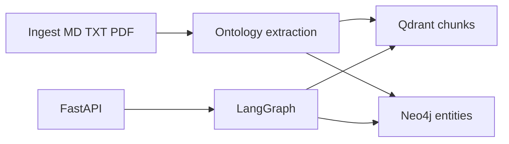

# Agentic GraphRAG for business strategy

Evidence-grounded **GraphRAG**: ingest legally obtained strategy documents, extract them into an explicit business ontology, retrieve over **Qdrant** (vectors) and **Neo4j** (graph), then answer through a **LangGraph** workflow that keeps retrieval separate from generation.

This is **not** a generic chatbot. The model is not treated as if it memorized a book. Answers cite chunks and graph edges.

The first intended knowledge domain is Alex Hormozi–style frameworks (offers, metrics, close rate, constraints). **Copyrighted books and playbooks are not in this repository.** Swap the corpus; the pipeline does not depend on Hormozi-specific vocabulary.

## Why GraphRAG instead of basic RAG

Basic RAG returns similar paragraphs. Strategy questions are relational:

> What is probably causing a business with lots of leads but a low close rate?

A useful answer walks **Business → Problem → Metric → Strategy → Prerequisite → Outcome** (for example: high lead volume is not the metric; close rate is; an unclear offer or weak follow-up is a candidate cause). Vectors find supporting passages; the graph stores `MEASURED_BY`, `SOLVES`, `IMPROVES`, and related edges so the agent can follow those links instead of guessing.

## Architecture



Monorepo: [`apps/agent`](apps/agent) (FastAPI + LangGraph + ingest/retrieval), [`packages/ontology`](packages/ontology) (extensible types), [`knowledge/`](knowledge) (synthetic samples + legal ingest notes). PostgreSQL is unused; provenance lives on Neo4j `Source` nodes and Qdrant payloads.

Details: [docs/architecture.md](docs/architecture.md). Local run: [docs/local-setup.md](docs/local-setup.md).

## Tech stack

| Layer | Choice |
|--------|--------|
| Workflow | LangGraph (typed `QueryState`, seven nodes + intent routing) |
| API | FastAPI + Pydantic |
| Vectors | Qdrant behind `VectorStore` |
| Graph | Neo4j behind `GraphRepository` (parameterized Cypher only) |
| Config | `uv`, Python 3.12+, pydantic-settings, `.env` |
| Local infra | Docker Compose |

No TypeScript: HTTP contracts are Pydantic models.

## Knowledge graph model

Registry version `1.0.0` in [`packages/ontology`](packages/ontology). New types register without rewriting stores.

**Entities:** Business, Customer, Offer, Problem, Metric, Strategy, Tactic, Concept, Constraint, Prerequisite, Outcome, LeadSource, BusinessStage, Evidence, Source.

**Relationships:** SOLVES, IMPROVES, REQUIRES, TARGETS, CAUSES, RELATED_TO, CONFLICTS_WITH, DERIVED_FROM, APPLIES_TO, MEASURED_BY, PART_OF.

Allowed edges are enumerated (for example Strategy `SOLVES` Problem, Problem `MEASURED_BY` Metric). Extraction rejects unknown types and disallowed edges.

## Retrieval pipeline

1. **Parse → normalize → chunk** Markdown, TXT, PDF (`IngestionService`).
2. **Extract** entities/relationships with an OpenAI-compatible LLM, constrained by the ontology.
3. **Embed** chunks; **upsert** Qdrant points (stable uuid5 ids) and Neo4j nodes/rels (idempotent `MERGE` on id).
4. **Query:** LangGraph retrieves a subgraph, then dense hits; `evaluate_evidence` drops weak scores and merges entity ids from chunks back into the graph.
5. **Hybrid helper** (`HybridRetriever`) is also used by the eval suite: vector hits seed graph expansion.

Each hit keeps source, document, section, chunk id, entity ids, and score.

## LangGraph workflow

```
START → understand_query → classify_intent
      → retrieve_graph_context → retrieve_vector_context
      → evaluate_evidence → reason → generate_answer → END
```

`out_of_scope` skips retrieval. `reason` / `/query` expose **evidence paths and a short summary**, not hidden chain-of-thought.

## Local setup

Python 3.12+, [uv](https://docs.astral.sh/uv/), Docker Compose.

```bash
cp .env.example .env
# set LLM_API_KEY and NEO4J_PASSWORD (compose defaults password to changeme)
uv sync
uv run pytest
uv run ruff check .
docker compose up --build
```

- API: http://localhost:8000/health  
- Qdrant: http://localhost:6333  
- Neo4j Browser: http://localhost:7474  

Host-only API (Compose for stores): `uv run uvicorn agent.api.main:app --reload --port 8000`

Unconfigured health app (no Neo4j): `uv run uvicorn agent.api.app:app --port 8000`

## How to ingest legally obtained documents

Do **not** add copyrighted Hormozi books to git. Place files you are allowed to process on disk, then:

```bash
curl -s -X POST http://localhost:8000/ingest \
  -H "Content-Type: application/json" \
  -d "{\"path\": \"/app/knowledge/samples/low-close-rate.md\", \"document_id\": \"low-close-rate\"}"
```

On the host, pass a filesystem path to your Markdown, TXT, or PDF. See [knowledge/README.md](knowledge/README.md). Synthetic demos: [knowledge/samples/](knowledge/samples/).

## Example queries

```bash
curl -s -X POST http://localhost:8000/query \
  -H "Content-Type: application/json" \
  -d "{\"question\": \"What is probably causing a business with lots of leads but a low close rate?\"}"
```

`POST /query` returns `answer`, `sources`, `graph_evidence`, `reasoning` (intent, restated question, evidence paths), and `retrieval`. Golden cases: [knowledge/eval/dataset.json](knowledge/eval/dataset.json).

## Testing

```bash
uv run pytest
uv run ruff check .
```

Unit tests mock LLM, Neo4j, and Qdrant. Eval ingest uses lexical embeddings so ranking is deterministic (`apps/agent/tests/test_eval_dataset.py`).

## Roadmap

- Live-model eval (precision of entity extraction, not only retrieval)
- Auth and multi-tenant corpora
- Stronger PDF layout / table handling
- Optional re-ranker and query rewriting
- PostgreSQL only if job history is required

## Copyright / knowledge-source disclaimer

This project does **not** download, vendor, or redistribute copyrighted books, playbooks, or paid courses. Hormozi’s work is a **domain example** for users who already have a lawful copy. The maintainers do not grant a license to those works. You are responsible for ingesting only material you are entitled to use.
