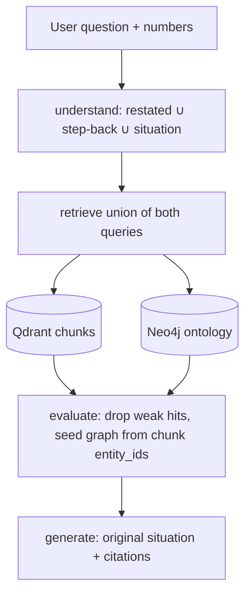

# Agentic GraphRAG for business strategy

**Hook:** strategy questions are graphs, not nearest-neighbor paragraphs. “Lots of leads, close rate fell 40% → 20%” is `LeadSource → Problem → Metric → Offer`. This repo stores that as **typed Neo4j edges**, keeps the passages in **Qdrant**, and only then lets the LLM **apply a playbook to the case** — it does not pretend the model memorized a book.

Not affiliated with Alex Hormozi or Acquisition.com. Hormozi-style offers/metrics are a **replaceable domain**. **No copyrighted books ship in git** ([`knowledge/README.md`](knowledge/README.md)). MIT licensed.



Monorepo: [`apps/agent`](apps/agent) · [`packages/ontology`](packages/ontology) · synthetic demos in [`knowledge/samples`](knowledge/samples). Details: [docs/architecture.md](docs/architecture.md).

## Why not basic RAG

Vectors match wording. A diagnosis needs `MEASURED_BY` / `SOLVES` / `IMPROVES`. Extraction is **ontology-constrained** (unknown types and illegal edges are rejected). Allowed entities include Offer, Problem, Metric, Strategy, Constraint; edges are enumerated in the registry.

## Tricks that actually matter

| Trick | Why |
|--------|-----|
| **Step-back for search only** | Broad playbook query hits “close rate + lead volume.” Generation still gets the gym, Instagram, and 40%→20%. |
| **Union retrieval** | Search restated **and** step-back; merge hits. Do not retrieve with the generic question alone. |
| **Evidence loop** | Vector hits’ `entity_ids` expand the subgraph (`evaluate_evidence`). Weak scores drop. |
| **Intent gate** | `out_of_scope` skips stores. Reasoning is evidence paths, not hidden CoT. |
| **Stable ids** | Qdrant uuid5 + Neo4j `MERGE` — re-ingest is idempotent. |
| **Local BGE-M3** | Embeddings stay on-box (1024-d). Chat/extract is any OpenAI-compatible LLM. |
| **Ingest survival** | Image PDFs → RapidOCR. Bad JSON chunks are skipped, not a whole-run abort. Salvage truncated LLM JSON. |
| **Char chunks, not tiktoken** | DeepSeek tokenizer ≠ OpenAI BPE; `INGEST_MAX_CHARS` is honest. |

LangGraph path:

```
START → understand_query → classify_intent
      → retrieve_graph → retrieve_vector → evaluate_evidence
      → reason → generate_answer → END
```

Stack: Python 3.12, uv, FastAPI, LangGraph, Qdrant, Neo4j, Docker Compose. Parameterized Cypher only; rel types interpolated from the ontology whitelist.

## Run

```bash
cp .env.example .env   # LLM_API_KEY; change NEO4J_PASSWORD before sharing a host
uv sync
uv run pytest
uv run ruff check .
docker compose up --build
```

- API http://localhost:8000/health · Qdrant :6333 · Neo4j :7474  
- Host API + Compose stores: `uv run uvicorn agent.api.main:app --reload --port 8000`

```bash
curl -s -X POST http://localhost:8000/ingest \
  -H "Content-Type: application/json" \
  -d "{\"path\": \"/app/knowledge/samples/low-close-rate.md\", \"document_id\": \"low-close-rate\"}"

curl -s -X POST http://localhost:8000/query \
  -H "Content-Type: application/json" \
  -d "{\"question\": \"What is probably causing a business with lots of leads but a low close rate?\"}"
```

`/query` returns `answer`, `sources`, `graph_evidence`, `reasoning` (intent, restated, step-back, situation, evidence paths). Eval: [`knowledge/eval`](knowledge/eval) (lexical embeddings, no live LLM).

Ingest **only** files you may process. Keep paid corpora off git (`data/`, `.cache/` ignored).
