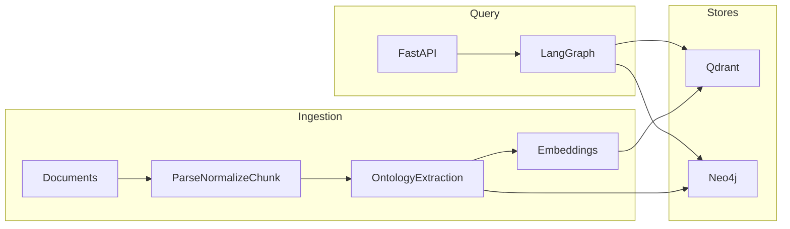

# Architecture

Agentic GraphRAG for business strategy. The first knowledge domain is Hormozi-style frameworks; the **code is knowledge-source replaceable**. This is not a generic chatbot: answers are grounded in retrieved chunks and graph edges with source attribution.

## Why GraphRAG

Basic RAG retrieves similar text. Strategy questions need causal structure (problem → metric → strategy → prerequisite → outcome). Neo4j stores typed edges; Qdrant stores passages; LangGraph chooses what to retrieve and how to cite it.

## Layout

```
/
├── apps/agent/          # FastAPI, LangGraph, ingest, retrieval, eval helpers
├── packages/ontology/   # Entity/relationship schemas + registry
├── knowledge/           # Synthetic samples, eval dataset, legal ingest notes
├── docker/agent/        # API image
├── docs/
├── docker-compose.yml
├── pyproject.toml
└── README.md
```

PostgreSQL is omitted. Document identity is Neo4j `Source` nodes plus Qdrant payload metadata. Chunk and entity ids are stable for re-ingest.

## Runtime



Ingest: document → parse → normalize → chunk → extract → embed → Qdrant + Neo4j.

Query: `POST /query` → LangGraph (`understand_query` restates + step-back + situation → `classify_intent` → graph retrieve ∪ vector `retrieve_union` on both queries → `evaluate_evidence` → `reason` → `generate_answer` with the original situation). `out_of_scope` skips retrieval. Evidence evaluation merges chunk entity ids into the subgraph.

## Modules (`apps/agent/src/agent`)

| Module | Role |
|--------|------|
| `config/` | Environment settings. No secrets in git. |
| `domain/` | Agent wrappers around ontology entities/rels. |
| `ingestion/` | MD/TXT/PDF parse, chunk, `IngestionService`. |
| `extraction/` | Ontology-constrained LLM extraction. |
| `embedding.py` | BGE-M3 local, Voyage, or OpenAI-compatible embeddings. |
| `repositories/` | `VectorStore` / `GraphRepository`; Qdrant, Neo4j, in-memory fakes. |
| `retrieval/` | Vector, graph, hybrid. |
| `graph/` | LangGraph `QueryWorkflow` + `QueryState`. |
| `api/` | `/query`, `/ingest`, `/health`. `app` is unconfigured; `main` loads settings. |
| `eval/` | Eval dataset loader + lexical embeddings. |

Cypher and Qdrant filters use parameters. Relationship types interpolated into Cypher are ontology-whitelisted `UPPER_SNAKE` identifiers only.

## Ontology

Versioned `OntologyRegistry` (`ONTOLOGY_VERSION = 1.0.0`).

**Entities:** Business, Customer, Offer, Problem, Metric, Strategy, Tactic, Concept, Constraint, Prerequisite, Outcome, LeadSource, BusinessStage, Evidence, Source.

**Relationships:** SOLVES, IMPROVES, REQUIRES, TARGETS, CAUSES, RELATED_TO, CONFLICTS_WITH, DERIVED_FROM, APPLIES_TO, MEASURED_BY, PART_OF.

Extend with `register_entity_type` / `register_relation_type` / `allow_edge`.

## Retrieval metadata

Chunks carry: source, document, section, chunk id, entity ids, score. API `QueryResponse` maps those to `sources`, `graph_evidence`, `reasoning` (not chain-of-thought), and `retrieval`.

## Copyright

Do not commit copyrighted books or playbooks. Ship schemas, code, synthetic samples, and ingest instructions only. Extraction prompts list ontology types, not a specific author brand.

## Tech stack

LangGraph, Python 3.12, FastAPI, Qdrant, Neo4j, Docker Compose, uv, Pydantic. Implemented versions are pinned in `uv.lock`.

## Related docs

- [README.md](../README.md)
- [local-setup.md](local-setup.md)
- [milestones.md](milestones.md)
- [knowledge/README.md](../knowledge/README.md)
