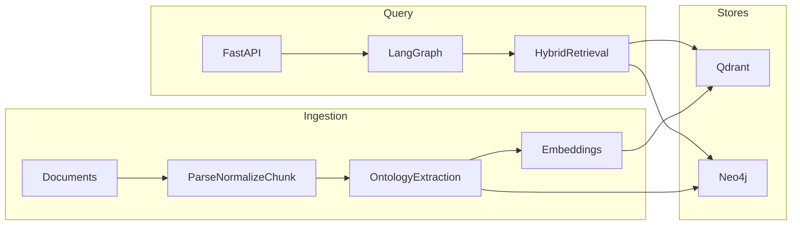

# Architecture

Agentic GraphRAG for business strategy. The first knowledge domain is Alex Hormozi-style frameworks, but the pipeline is **knowledge-source replaceable**. This is not a generic chatbot: answers must be grounded in retrieved vector chunks and graph evidence with source attribution.

## Inspection (M0)

The repository started as a single `Initial commit` containing only a LangGraph `.gitignore`. There is no prior application code. Implementation proceeds greenfield, one milestone commit at a time.

## Why GraphRAG

Basic RAG retrieves similar text. Strategy questions need **causal and structural links**: a problem maps to a metric, a metric to a strategy, a strategy to prerequisites and expected outcomes. A knowledge graph encodes those links; vectors recover supporting passages; a LangGraph workflow decides what to retrieve and how to use it.

## Target layout

```
/
├── apps/agent/          # FastAPI, LangGraph, ingestion, retrieval
├── packages/ontology/   # Extensible business entity and relationship schemas
├── knowledge/           # Synthetic samples and legal ingest instructions
├── docker/              # Local infrastructure extras
├── docs/
├── docker-compose.yml
├── pyproject.toml
├── uv.lock
├── .env.example
└── README.md
```

PostgreSQL is **not** in the initial stack. Document identity and provenance live on Neo4j `Source` / `Evidence` nodes and Qdrant chunk payloads, with idempotent ingest keys.

## Runtime



Ingestion: document → parse → normalize → chunk → extract entities → extract relationships → embeddings → Qdrant + Neo4j.

Query: FastAPI → LangGraph (typed state) → hybrid retrieval → evidence evaluation → grounded answer.

## Agent modules (`apps/agent/src`)

| Module | Role |
|--------|------|
| `config/` | Environment-based settings. No secrets in git. |
| `domain/` | Agent-facing models wrapping ontology types. |
| `ingestion/` | Markdown, TXT, PDF parse, normalize, chunk; idempotent IDs. |
| `extraction/` | Ontology-constrained entity and relationship extraction. |
| `retrieval/` | Vector, graph, and hybrid retrieval with chunk metadata. |
| `graph/` | LangGraph workflow: understand, classify, retrieve, evaluate, reason, generate. |
| `api/` | `POST /query`, `POST /ingest`, `GET /health`. |

**Vector store interface:** collection init, chunk upsert, metadata filter, similarity search. Qdrant is an implementation, not the business-logic surface.

**Graph repository interface:** entity upsert, relationship create, subgraph retrieval. Cypher is parameterized only; never interpolate user text into queries.

## Ontology

Explicit types, not unbounded LLM labels. Extensible via a versioned registry.

**Entities:** Business, Customer, Offer, Problem, Metric, Strategy, Tactic, Concept, Constraint, Prerequisite, Outcome, LeadSource, BusinessStage, Evidence, Source.

**Relationships:** SOLVES, IMPROVES, REQUIRES, TARGETS, CAUSES, RELATED_TO, CONFLICTS_WITH, DERIVED_FROM, APPLIES_TO, MEASURED_BY, PART_OF.

Typical reasoning path: Business → Problem → Metric → Strategy → Concept → Prerequisite → Outcome.

## Retrieval

1. Dense search in Qdrant.
2. Graph traversal in Neo4j.
3. Hybrid combination of both.

Each chunk retains: source, document, section/chapter, chunk id, related entities, relevance scores.

The model does not pretend to have the books in weights. Answers cite retrieved evidence.

## LangGraph workflow

Typed graph state. Retrieval nodes are separate from reasoning and generation.

```
START
→ understand_query
→ classify_intent
→ retrieve_graph_context
→ retrieve_vector_context
→ evaluate_evidence
→ reason
→ generate_answer
→ END
```

Conditional routing after intent classification where useful (for example, skip graph hop when no entities match).

API responses include answer, retrieved sources, graph evidence, and a **safe reasoning summary** (evidence paths). Hidden chain-of-thought is not exposed.

## API

Pydantic request and response models. `/query` returns answer, sources, graph evidence, retrieval metadata, and structured reasoning summaries only.

## Copyright

Do not download, commit, or redistribute copyrighted books or playbooks. The repository ships schemas, pipelines, synthetic samples, and instructions for users to ingest material they are legally entitled to use. Ingestion code must not depend on Hormozi-specific terminology.

## Tech stack

LangGraph, Python, FastAPI, Qdrant, Neo4j, Docker Compose, uv, Pydantic. TypeScript only if API contracts require it. Current stable, compatible package versions at implementation time.

## Milestones

| ID | Scope | Status |
|----|--------|--------|
| M0 | Inspection + architecture docs | This document |
| M1 | Python project setup + configuration | Next |
| M2 | Business ontology + domain models | |
| M3 | Neo4j graph repository | |
| M4 | Qdrant vector repository | |
| M5 | Document parsing + chunking | |
| M6 | Entity/relationship extraction | |
| M7 | Complete ingestion pipeline | |
| M8 | Vector retrieval | |
| M9 | Graph retrieval | |
| M10 | Hybrid retrieval | |
| M11 | LangGraph query/reasoning workflow | |
| M12 | FastAPI API | |
| M13 | Tests + evaluation dataset | |
| M14 | Docker / local DX | |
| M15 | README + architecture polish + cleanup | |

Each milestone is one conventional commit after tests and review. Do not implement the full product in a single change.
